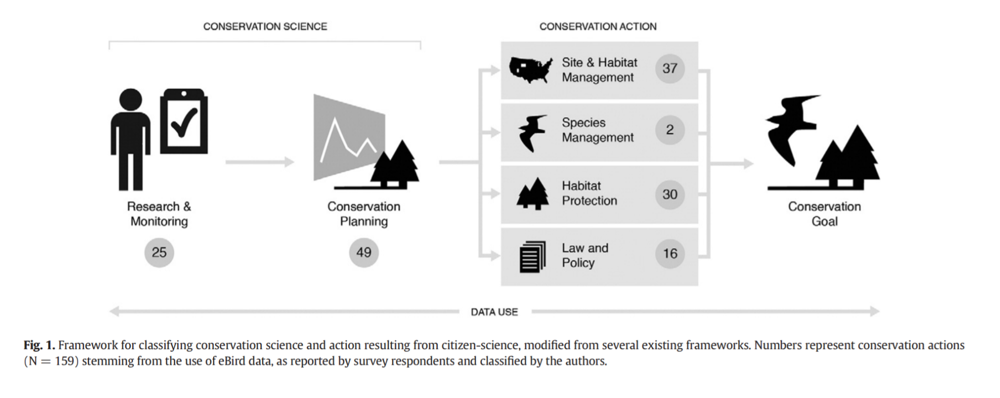
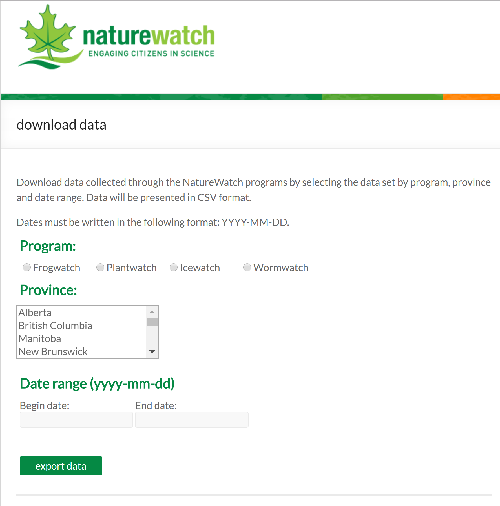

# What is Citizen Science? #

Citizen science is best understood as the involvement of the general public in scientific knowledge production in collaboration with professional scientists, a phenomenon that gained popularity steadily from the 1990s onward in conjunction with the diffusion of internet technologies. 
 
Synonymous and/or closely related terms include: do-it-yourself science (DIY science), peer-to-peer science (P2P science), public participation in scientific research (PPSR, a term used more often in Europe), Volunteered Geographic Information (VGI), and, in French, _sciences citoyennes_, _sciences participatives_, or _sciences collaboratives_.

## Who are citizen scientists?

Citizen scientists, for the most part, have little formal scientific
training. They are simply members of the public who volunteer their
time, and are accepted into a project regardless of their formal
education.

That said, while most citizen scientists may be average hobbyists, in
some cases, these participants take part in separate activities that
make them ideal citizen science contributors. For instance, some are
geocachers, who venture to otherwise inaccessible geographic
locations, others, civil engineers and construction workers, who often
view subsoil in ways ideal for scientific observation (Show, 2015).

## What sort of centralized institutions run citizen science projects?

Citizen science projects are run by universities, governmental
organizations, non-governmental organizations and corporations
alike--in any sector that professional scientists work, you can find
citizen science. As for disciplinary affiliation, the fields on the
cutting edge of citizen science practice include ecology, ornithology
and astronomy.
 
What kinds of scientific activities do citizen scientists do?  How, exactly, citizen scientists can best participate in scientific knowledge production is still a matter of debate, especially as citizen science keeps gaining in popularity at an incredible rate (Gura 2013; Sullivan et al. 2016), in a matter yet to be determined by convention.
 
That said, here are a number of activities that commonly characterize citizen scientists’ work: 

- *Distributed computing*: In this model, citizen scientists download computer software which utilizes a portion of their personal computer's power when it is otherwise in disuse and devotes it to running computationally intensive science on behalf of the centralized project (Delfanti, 2013). Examples of this model include [Rosetta@home](https://boinc.bakerlab.org/&sa=D&ust=1496868794621000&usg=AFQjCNFXTfFNUSv7wb0ZgaPRNKvAEP6foQ) and [Folding@home](http://folding.stanford.edu/&sa=D&ust=1496868794621000&usg=AFQjCNFETSkst_c3mBjETu9wQp7SZo_iOg), both of which investigate protein structure.
- *Observation*: Many of the most well-known citizen science projects involve members of the public participating in the observation stage of scientific discovery. This means that they collect and process data for centralized institutions (Delfanti, 2013). Often this is out and about in the wild--collecting descriptions of animal species or water samples, for instance.
- *Data processing and analysis*: A large portion of citizen science projects currently operating today involve analyzing data that has been gathered and already somewhat processed by professional researchers. A common format for this sort of work is the following model: after undergoing a short online training session in which the participant learns to identify different categories of scientific phenomena, the volunteer then views and classifies data samples online. In this way, thousands have classified galaxies on the highly successful citizen science website [Galaxy
Zoo](https://www.galaxyzoo.org/&sa=D&ust=1496868794624000&usg=AFQjCNGb2igDNgINQPio0_fKuwmAI3bqJg). Other forms of data processing and analysis are more elaborately gamified, including Princeton’s neuroscience initiative [Eyewire](http://eyewire.org/&sa=D&ust=1496868794625000&usg=AFQjCNGqiH9gKrvFUFHwarQ0yVKfSUa08g), and NASA’s crater-counting project [Be a
Martian](https://beamartian.jpl.nasa.gov/welcome&sa=D&ust=1496868794625000&usg=AFQjCNE6Kg8UOBwwjdCi8zazRI9gtOT-xg).
- *Research question development, scientific project design*: It is also notable that “hybrid forums” online--forums that combine professional and non-expert scientific discussion, such as blogs and networking websites, open syllabi, open textbooks and open encyclopedias--arguably constitute a very important part of the contemporary landscape of citizen science (Delfanti, 2013). Further, in those data-collection citizen-science projects that are relatively localized initiatives, like water monitoring projects, citizen scientists’ contributions to the goals and structure of a project may be quite explicit. 

This particular typology, for the most part, relates categories of citizen scientist work to the various stages of the scientific method (in an attempt to simplify and introduce the field). Yet other, variously-organized frameworks abound. Muki Haklay (2013) offers a very interesting typology which aims to “highlight the power relationships that exist within social processes such as [professional sciences]” (ibid, p. 10). The following table provides a summary of this scheme (all text from p. 11-12, ibid):

| Level 1: Crowdsourcing | | | At the most basic level, participation is limited to the provision of resources, and cognitive engagement is minimal. |
| Level 2: Distributed Intelligence | | | The cognitive ability of the participants is the resource that is being used. The participants are asked to take some basic training, and then collect data or carry out a simple interpretation activity. |
| Level 3: Participatory Science | | | Problem definition is set by the participants, and in consultation with scientists and experts, a data collection method is devised. The participants are then engaged in data collection, but require the assistance of the experts in analysing and interpreting the results. |
| Level 4: Extreme Citizen Science | | | Professional and non-professional scientists are involved in deciding on which scientific problems to work and the nature of the data collection. This mode of science also opens the possibility of citizen science without professional scientists, in which the whole process is carried out by the participants to achieve a specific goal. |

## When did this movement begin? 

Laypeople have been making immeasurable contributions to scientific research throughout human history (Conner, 2009), but further, the specific model of citizen science has precedent centuries old. Discoveries made by common people have always been a key part of archaeological and astronomical practice--disciplines wherein skill and geographic location of observation are just as important as training and equipment (Silvertown, 2009). More specifically, lighthouse keepers in the 1800s collected observations of bird strikes for scientists (Bonney et al., 2009), and in 1900, the American NGO the Audubon Society began the Christmas Bird Count campaign, an attempt to harvest data from the public for ecological monitoring (Show, 2015).
	That said, the phenomena we are witnessing now is distinct: it is most accurately dated to have began in the 1990s, and is closely tied to the development of the internet (Delfanti 2013). Besides its dependence on digital technologies, the citizen science movement we are witnessing today can be said to be distinct from past iterations given the development of specific practices including “explicit and tested protocols for collecting data” and the “vetting of data by professionals” (Bonney et al., 2009, 978). Key, early discussions of citizen science practice which served to focus the movement include articles by Cornell ornithologist Rick Bonney (1995) and British sociologist Alan Irwin (1996).

## Why did this movement begin?

Citizen science doubtless owes much of its recent growth to today’s technologies (Silvertown, 2009). The internet allows for the speedy and geographically-dispersed transfer of observation data from citizen scientists to professional scientists. Undoubtedly, the ubiquity of smartphones equipped with satellite navigation, cameras and other sensors have further accelerated the movement (Show, 2015). 
	While contemporary tech has been a key driver of citizen science popularity, another important part of the picture is the environmental movement. As it became more well-known that human industrial activity was having hugely harmful impacts on natural ecosystems, many individuals and non-governmental organizations wanted to ensure that changes in species behaviour and ecosystem health were being monitored (Conrad and Hitchley, 2011). 
	Another consideration is what Science and Technology Studies theorist Sheila Jasanoff terms “the participatory turn” (2003; Shirk et al., 2012) in science governance. The research funding agencies of many nations have recently begun to mandate that grant holders design public outreach and/or participation components for their projects. Integrating citizen science into their research design allows scientists to meet this criteria--another boon for the movement’s popularity.
	
## Has citizen science produced meaningful work?
- It has done no less than increase the scope and speed of work possible in certain fields--in the words of Cornell ornithologists, citizen science has allowed conservation scientists to “gather or analyze data at volumes, scales, and a level of immediacy not possible through traditional techniques” (2016, 208).
- It has contributed to the advancement of science dealing with some of the most pressing issues of the today: 
    - [Foldit](https://fold.it/portal/info/about&sa=D&ust=1496868794647000&usg=AFQjCNFaksqwCgBrEMrncL6Ve6gw-LohtA), a collaborative protein folding game, has advanced the study of HIV/AIDS (Bowser and Shanley, 2013).
    - Citizen science ecosystem- and species-monitoring datasets are key to monitoring climate change. The Canadian programs coordinated by NatureWatch (profiled below) are great examples of such initiatives. 
- It has allowed citizens to directly influence local policy and to support their local communities : 
  - University College London’s initiative Extreme Citizen Science (ExCiteS) was able to use the data from a citizen science project to demonstrate that a local scrapyard was violating noise limits in the area. In response to this data, the UK Environment Agency had the scrapyard’s licence revoked (Haklay, Francis & Whitaker, 2008).
  - A research team from The Virginia Tech created a [citizen science project](http://flintwaterstudy.org/about-page/about-us/&sa=D&ust=1496868794649000&usg=AFQjCNHK_GCEs_M16jTIeC6DeNnYU7JZag) in response to the Flint Water Crisis.
- It has formed the basis of much scientific research:
  - Galaxy Zoo has produced more than 50 peer-reviewed [scientific publications](https://www.zooniverse.org/about/publications&sa=D&ust=1496868794651000&usg=AFQjCNHUOzzrdj0WLFhTOEMUQkew0Ygbvg) using citizen science data.
  
# Open data produced by citizen science
 
Now that we understand what citizen science is, how does it relate to open data? Citizen science and open data are movements that arose at a roughly similar historical moment and with similar speed. They can be understood as parallel but distinct branches of the broader movement often called open science. Given the incredible speed at which each of these branches has developed, and the number of complex, internal debates each has needed to navigate, these movements are only recently beginning to look outward and formally bridge one another. 

Perhaps the most obvious way in which the citizen science and open data movements need to coordinate and address is the production of open data by citizen science projects.
 
## How open is citizen-science data?
As explained in the body of this Citizen’s Guide, open data is data that is open access, open format and open license (a definition drawn, in turn, from the [Open Knowledge Foundation](https://okfn.org/&sa=D&ust=1496868794655000&usg=AFQjCNFTZvUnSLyvkMjz5INg-mqrUzy_sg)). Let’s consider each category of openness individually:

- Is citizen-science data open access?
  - Open Access means that “data must be freely available for download online”. This is sometimes the case, but more often than not a citizen scientist’s contribution disappears into the closed databases of centralized institutions. 
- Is citizen-science data open format?
  - Open Format means that “data must come in file formats that do not require proprietary software to open. Open Data must also be machine-readable.” For the most part, where citizen science data is open access, it seems to be available in machine-readable format (most often .csv files). 
- Is citizen-science data open-license?
  - Open license means that “data must be released with a license that conforms with open requirements”. In the words of Groom (2016), “contrary to what many people assume, data sets from volunteers are among the most restrictive in how they can be used” (p. 612).

## Why is data often closed in citizen science?
As is implied by Hampton et al (2013), the conventions of scientific publication have prevented data-sharing; the competition between scientists for limited funding and prestige means that data often gets treated “just as a precursor to publications”, as opposed to an “enduring product of research” (p. 156). While an important consideration in this context, this is not an issue particular to the political economy of citizen science, and is instead an issue faced by the open data and open science movements at large. 
 An issue more specific to citizen science is the unusual burden of post-processing that such projects must accommodate. Citizen science projects produce course data in huge volumes, meaning that professional scientists must devote substantial resources toward data validation and verification (Borgman, 2012), as well as to the management of online repositories and tools (Gura, 2016). Projects like Cornell’s eBird--a highly respected American citizen science initiative that monitors bird wildlife--must process 25 million observations a month. In the words of Philip Brohan, climate scientist, “citizen science is enormously expensive in terms of time and effort managing people, websites and databases” (Gura, 2013).

## Should citizen science data be open?
Many in the scientific community have formally stated that this state of affairs needs to change. In a paper penned by leading professional scientists who work with citizen science data, Bonney et al. (2009) state that “whether a project employs paper or electronic data forms, all of the information must be accepted, edited, and made available for analysis, not only by professional scientists, but also by the public” (p. 981). 
Further, a number of professional scientists have offered specific arguments as to why citizen science data must be made open:

- Perhaps the most obvious point is worded by Groom et al. (2016): “The voluntary aspect of the time invested by citizen scientists is generally interpreted as being motivated primarily by its contribution to society and that society should profit from this effort through openly accessible data” (p. 612). 
- Opening data offers the opportunity for projects to be at the “forefront of socially relevant science” (p. 156, Hampton et al. 2013).
- Opening data supports reproducible science (Groom et al., 2016).
- Opening data may motivate citizen scientists to participate in projects with greater frequency and depth. Preliminary evidence supporting this argument: even simple, online data-visualization tools provided by citizen science sites in order to allow participants to track their contributions and view project results appear to drive participant involvement) (Bonney et al., 2009).
- Open data promotes participant education--in the words of Bonney et al, “allowing and encouraging participants to manipulate and study project data is one of the most educational features of citizen science” (p. 981).
- Feedback from the public’s analysis of open data can help direct future research and project development (Sullivan et. al, 2013). 
- Open citizen science data, especially from community-level ecosystem-monitoring projects, can allow citizens and decision-makers evidence with which to influence policy without having to wait long periods for more formal environmental assessment mechanisms. In the words of ornithologists Sullivan et. al (2017), “Open access observational databases could help to close the gap between knowledge and action by providing data resources that allow a broad diversity of potential users to extract the information needed to address a particular conservation challenge” (p. 5). 

## Once citizen science data is made open, how do people use it?
Researchers at the Cornell Lab of Ornithology and University of Maryland recently analyzed survey data from those who had registered with the citizen science project eBird and downloaded it’s open data (Sullivan et al. 2016). While this study provides only preliminary evidence, it seems that participants used this particular resource of open data to produce tangible conservation efforts. The graphic below summarizes a major component of their findings, and you can find the entirety of the report [here](http://ebird.org/ebird/data/download&sa=D&ust=1496868794676000&usg=AFQjCNFZd-x_3Xw6HiUDIkLHtbtFtVvGQQ).

Convervation Framework from Sulivan et al., 2016

## What are the next steps to open citizen-science data?
So, for many reasons it seems that opening up the data from citizen science projects is desirable… But how can this goal be accomplished? What are the best practices for opening citizen science data?
 
### Follow the precedents set by leading citizen science projects
At the time of writing, the following organizations boast state-of-the-art database management and well-constructed open access policy. 

- ebird: Since 2002, this initiative from the Cornell Lab of Ornithology has been a citizen science leader. Now an international project, it is also leading the charge for open data in citizen science. In the words of its head scientists, “a core principle of eBird is providing free and open access to data for a broad spectrum of data consumers” (p. 34, Sullivan et al. 2014). Upon registration, and submitting a request explaining why you are downloading the data (for their research purposes), you can download data [here](http://ebird.org/ebird/data/download). A data user agreement, including an open license, is included in all data downloads. 
 
- Globe at Night: Globe at Night is an initiative that has tracked night pollution since 2006. You can find their comprehensive database [here](https://www.globeatnight.org/maps.php) in its full, open access, open format splendor (datasets are available in .txt, .xls, .csv and .kmz format). This download page also clearly indicates that all Globe at Night data is open license, and directs readers to the full text of the [Open Database License](https://opendatacommons.org/licenses/odbl/) under which they operate. 

### Where possible, limit the burden of data post-processing 
In the words of Borgman et. al (2012), “generally speaking, the more handcrafted the data collection and the more labor-intensive the postprocessing for interpretation, the less likely that researchers will share their data”. Where possible, researchers should look to streamline data validation and verification ([while, of course, maintaining scientific integrity and data quality](https://crowston.syr.edu/sites/crowston.syr.edu/files/PID2090593.pdf)).

### Post explicit proprietary policy
Geothink scholars Teresa Scassa (co-applicant) and Leslie Chung (Ph.D. student researcher) are at the forefront of thinking on this topic. Their report, [“Managing intellectual property rights in citizen science: A guide for researchers and citizen scientist”](https://www.wilsoncenter.org/sites/default/files/managing_intellectual_property_rights_citizen_science_scassa_chung.pdf) (2015) offers detailed and contextualized advice on how to think through the complex connections between citizen science and copyright law. As the title suggests, the linked document is a guide for both researchers and citizens scientist participants. 
On the specific issue of open data, they warn that simply “releasing data into the public domain” by allowing downloads without posting any explicit copyright policy alongside this data is not the best idea. They council to instead employ clear open access licensing. They reason that such licensing is important because it:
- “may allow you to attach conditions such as attribution, non commercial use, or share-alike”.
- “ensure proper acknowledgement”
- “limit uses considered inconsistent with project goals” (for instance, commercial use) (26). 

### Centralized institutions, not just professional scientists, must open their intellectual property (IP) policy
In the words of Teresa Scassa, “Researchers at universities have a complex web of relationships. Their universities have IP policies; those IP policies might provide that all IP stemming from this research may belong to the university and not the researcher, so they may not be able to promise certain things in their projects. Their funders may have expectations, and their publishers may have expectations” (in Bloch, 2015). Thus, responsibility for opening up citizen science data falls not only upon the professional scientists directly managing citizen science projects, but also with the centralized institutions that employ the professional scientists.

### Require registration for all data downloads
One particularly useful mechanism with which to apply the sort of proprietary policy recommended by Scassa and Chung is that of registration. The idea is that as part of registration, users must formally consent to project policy--and in-so-doing agree that data from the project will not be misused. This is very useful because it both informs participants of the site’s data licensing and requires that they agree to respect usage terms. Additionally, as the professional scientists behind the leading citizen-science  eBird researchers point out, registration allows for the analysis of data-usage trends and, given that it requires the submission of an email address, facilitates communication between those accessing the data and the professional scientists running the project (Sullivan et al. 2014). 
 
### Centralize and link datasets
Larger citizen-science institutions are leading the charge on open data, so the more datasets are integrated into their databases, the more data will be made open. Further, there is the issue of linking citizen science data with non-citizen science data. In the words of Dickenson et al. (2010), “online data warehouses will play a critical role in linking citizen science data with other databases” (p. 167), and many of these repositories are being made open in the course of the open science movement. So, in short, as citizen science databases are centralized and linked--a “complex and computationally intensive” process (p. 167, Dickenson et al. 2010)--database openness may be applied to citizen science top-down. 

## When should citizen science data openness be limited?
 
### Privacy  
Privacy must be a key consideration in all matters of data openness. For instance, often-times those collecting data sign up using their home address as part of the data-submission process. Such information should not be made public. 
 
### Traditional knowledge
In the words of Scassa and Chung (2015), “there is a growing international consensus that traditional knowledge deserves some measure of protection, and that there are ethical boundaries to its collection and use” (26). Some citizen science projects draw on said traditional knowledge, particularly in community-monitoring projects. This is an especially important consideration in Canada, as projects may involve the traditional knowledge of indigenous peoples. The needs and interests of indigenous communities must be carefully considered and prioritized in decisions to open project data, and, moreover, these decisions must be made in consultation with the communities themselves (Ibid). 

## How can I be sure of the quality of citizen science open data?
One of the earliest-arising and most persistent controversies facing the citizen-scientist community is that of data quality. Many skeptics have been quieted by highly-reputed studies demonstrating that citizen scientists are capable of producing high-quality data collection (see [Danielsen et al. 2014](http://coleburton.weebly.com/uploads/1/5/1/0/15105302/bioscience-2014-danielsen-236-51.pdf)). Issues like sampling bias, measurement error and spatial clustering are problems that continue to arise in some citizen science datasets (Bonney et al., 2014). 

That said, in the words of Hacklay (2013), perhaps researchers should begin “viewing uncertainty not as something that can be eliminated through tighter protocols but as an integral part of any data collection”, and as such, significant efforts should be focused on the development of “appropriate methods to deal with [citizen science data] during analysis” (p. 14). After all, there is no such thing as a perfect dataset in any field or practice. Further, the citizen science movement boasts a community that has discussed these problems at length and developed data science techniques to ensure sound analysis (Bonney et al. 2014). If you are looking to utilize citizen science data yourself, you may want to listen in on this conversation:

- Hunter, J., Alabri, A., & Ingen, C. (2013). Assessing the quality and trustworthiness of citizen science data. Concurrency and Computation: Practice and Experience, 25(4), 454-466.
 
- Bird, T. J., Bates, A. E., Lefcheck, J. S., Hill, N. A., Thomson, R. J., Edgar, G. J., ... & Pecl, G. T. (2014). Statistical solutions for error and bias in global citizen science datasets. Biological Conservation, 173, 144-154. (find the PDF [here](https://www.researchgate.net/publication/257316043_Statistical_solutions_for_error_and_bias_in_global_citizen_science_datasets)). 
 
- Munson, M. A., Caruana, R., Fink, D., Hochachka, W. M., Iliff, M., Rosenberg, K. V., ... & Kelling, S. (2010). A method for measuring the relative information content of data from different monitoring protocols. Methods in Ecology and Evolution, 1(3), 263-273. (find the PDF [here](http://onlinelibrary.wiley.com/doi/10.1111/j.2041-210X.2010.00035.x/full))

# Canadian Citizen Science Project Releasing Open Data

## [NatureWatch](https://www.naturewatch.ca/&sa=D&ust=1496868794699000&usg=AFQjCNEuxQ5qvU267OZYvjFo2s1JGHUKcQ)

A screenshot of NatureWatch’s highly accessible database search
 
The NatureWatch program is an initiative managed by the University of Ottawa Laboratory for Integrated Environmental & Policy Change in collaboration with the NGO Nature Canada, and an open data leader amoung Canadian citizen science projects. Its explicit data policy can be found [here](https://www.naturewatch.ca/data-policy/&sa=D&ust=1496868794701000&usg=AFQjCNEt9wYqOWhQ8WIsruIxy86_Ld-_Jg) (all data is open access, though limited to not-for-profit usage). Accessible upon registration, Nature Watch’s  highly-accessible database search can be found [here](https://www.naturewatch.ca/download/&sa=D&ust=1496868794701000&usg=AFQjCNF0HzzrfV_rq929rOvFgrCwpMEKtQ) (all files available in .csv format). The data in this database is collected from four citizen science programs:
 
## [FrogWatch](https://www.naturewatch.ca/frogwatch/&sa=D&ust=1496868794702000&usg=AFQjCNH7uB--1vPGOgpGk_lp23QlLrfSTA) 
FrogWatch tracks changes in the population of frogs and toads, their geographic range, and the range of their calling season. The program is a form of climate-change monitoring, and more specifically, wetland-habitat monitoring, given that frogs are an excellent “indicator species”--they are sensitive to changes in atmosphere, land and water. 
 
## [PlantWatch](https://www.naturewatch.ca/plantwatch/&sa=D&ust=1496868794704000&usg=AFQjCNFiMR6a6xIT-pW8mlpu2uQMp-H-4w)
PlantWatch monitors blooming times in an effort to understand the effects of climate change--scientists predict that increases in temperature will cause flowers and plants to bloom earlier in Northern and Western Canada, and that lower temperatures in Eastern Canada will cause later blooming times. 
 
## [IceWatch](https://www.naturewatch.ca/icewatch/&sa=D&ust=1496868794705000&usg=AFQjCNFjInOmSCDxizZYTeEJI9cLQrgJYA)
IceWatch collects data on “ice events” like the freeze and thaw dates of lakes and rivers to aid in understanding climate change. Citizen science is especially important to monitor such events because there are large geographic gaps in the current ice-monitoring network of professional scientists. 
 
## [WormWatch](https://www.naturewatch.ca/wormwatch/&sa=D&ust=1496868794707000&usg=AFQjCNE1sz_MMZNT5c0YfwEZu8xcPbIjlg)
WormWatch asks citizen scientists to measure the number of worms in a given volume of dirt. Given that earthworms are sensitive to disturbances in the soil, scientists can discover a lot about ecosystem health from this data
 
## [Bird Studies Canada](http://www.birdscanada.org/volunteer.jsp?lang%3DEN&sa=D&ust=1496868794708000&usg=AFQjCNHXTFvkhtpsW4EzdtjgSIykKKrKTg)
Bird Studies Canada is the leading ornithology data organization in Canada, being the Canadian branch of the international organization Avian Knowledge Network (other nodes include Cornell Lab of Ornithology, Point Reyes Bird Observatory and Redwood Sciences Lab of the United States Forest Service). They offer data for download [here](https://www.birdscanada.org/birdmon/default/searchquery.jsp&sa=D&ust=1496868794709000&usg=AFQjCNGz0-GddUOG8Fe3rB3Nt7xIUsqfmg) (this portal also offers access to data from across the Avian Knowledge Network). As part of the Avian Knowledge Network, this data is in six different levels of open access depending on the dataset, as explained [here](https://www.birdscanada.org/birdmon/default/akn_access_levels.jsp&sa=D&ust=1496868794709000&usg=AFQjCNFKoFpWkMPhXcBwjNlhb8NdKZp-3w). Additionally, those wishing to download the data must register with Bird Studies Canada.
 
## [TreeTaggr](https://www.treetaggr.info/&sa=D&ust=1496868794710000&usg=AFQjCNHCTWpqWO1kN7qZHHmaCuNejJC5cg)
This project aims to track the spread of tree diseases; citizen scientists record data by tweeting photos of diseased trees. It is organized by the American NGO The Institute of Forest Biotechnology, but this particular initiative has received significant funding from Natural Resources Canada in an effort to promote its use north of the border. You can download data (tree tags) in .csv format [here](https://treetaggr.org/&sa=D&ust=1496868794711000&usg=AFQjCNGgoDb55ftygLrvbv2qzNVe6njldg)]. 
 
## [Snowtweets](http://snowtweets.uwaterloo.ca/index.html&sa=D&ust=1496868794712000&usg=AFQjCNF4WHhUcXEbqFwTnJVoziweuV_EJA)
This project out of University of Waterloo’s Department of Geography and Environmental Management aims to track meteorological data, in particular, snow depth. Citizen scientists contribute data by tweeting. This data aids in recording the shrinking of the snow season in relation to climate change, and the severity of storm systems (Witten, 2013). Their website includes a data download portal, although this does not appear to have been maintained at the time of writing (2017). 
 
## [The Community-Based Environmental Monitoring Network](https://cbemn.ca/&sa=D&ust=1496868794713000&usg=AFQjCNF8_CIc3NCFTD_wiJbu6kG7ugivGg) (CBEN)
Founded in 2004 and based at Saint Mary’s University in Halifax, the CBEN is an organization that supports local water monitoring. In addition to providing training, a resource not uncommon for citizen science programs to offer, this organization even loans equipment to local-level stewardship programs in an effort to ensure that environmental monitoring is an accessible to all. While data produced from this project is not open license, you view the data [here](http://cbemn.ca/water-quality/&sa=D&ust=1496868794714000&usg=AFQjCNGUk9_q4sG0ZcCEwSd3zRMasyWCVw). Further, you can download the data at that link in CSV format provided you have registered with a local stewardship program (identify the one nearest you [here](http://cbemn.ca/resources/stewardship-map/&sa=D&ust=1496868794715000&usg=AFQjCNHCplCt2bpbo5CKCXkTRT-MXQnaaQ)).  
 
## [Nature Alberta’s May Species Count](http://naturealberta.ca/programs/birds-biodiversity/citizen-science-database/&sa=D&ust=1496868794716000&usg=AFQjCNEWLxK_1LPq2SB2L99Mf_Tdz1ESxQ)
Nature Alberta, an NGO, has organized an annual May Species Count since 1976. Flowering plants, birds and some mammals are recorded. You can find an .xlsx file here that includes all data from 2006-2016. The initiative shares all of its bird data with Bird Studies Canada, and all of its plant data with PlantWatch Canada, so if you are seeking more comprehensive datasets it may be better to look to those more centralized databases (see links above). 
 
 
# Inventories of Canadian citizen science projects
 
While many of the projects listed in these inventories do not provide open data at the time of writing, this may very well change. Check these listings for updates on this matter, or to find citizen science projects near you.
 
## [The Government of Canada](http://www.science.gc.ca/eic/site/063.nsf/eng/h_97169.html)
This list focuses on government-affiliated citizen science initiatives, including programs run by Agriculture and Agri-food Canada, Natural Resources Canada and Fisheries and Oceans Canada. 
 
## [David Suzuki Foundation](http://www.davidsuzuki.org/what-you-can-do/citizen-science/)
This environmental NGO is a member of the the U.S.-based [SciStarter](https://scistarter.com/) program. The foundation thus promotes involvement in the citizen science programs collected in [this](https://scistarter.com/finder) conveniently searchable database. Searching this database for those projects open to participants located in Canada yields more than 500 results. 
 
## [CurioCity](http://explorecuriocity.org/explore?res=Action+Projects)

This inventory is compiled by Let’s Talk Science, an NGO dedicated to STEM education. The projects on this list are youth-oriented. 
 
## [Ocean Networks Canada](http://www.oceannetworks.ca/learning/get-involved/citizen-science)
Ocean Networks Canada, a University of Victoria initiative dating back to 2007, runs a number of citizen science projects--though none are open data at the time of writing. An example project: Coast Buster collects data from citizen scientists who find large, unusual and/or potentially hazardous debris in the ocean.
 
## [Ontario BioBlitz](http://www.ontariobioblitz.ca/) and [BioBlitz Canada](http://www.bioblitzcanada.ca/)
A “bioblitz” is a type of citizen science that involves a lot of participant activity in a very short period of time, usually in the form of an ecological data-collection event. BioBlitz Ontario has been organizing annual, 24-hour bioblitz-s since 2012. In 2017, an affiliated organization called BioBlitz Canada has sprung up, which aims to co-ordinate bioblitz-s cross-country. 

# Works cited

Arnstein, S. R. 1969. A ladder of citizen participation. Journal of the American Institute of planners, 35(4), 216-224.

Bloch, N. 2015. Citizen Science and Intellectual Property: A Guide for the  Perplexed. Geothink. <http://geothink.ca/citizen-science-and-intellectual-property-a-guide-for-the-perplexed/>

Bonney, R. (1996). Citizen Science – A Lab Tradition, *Living Bird*, Autumn 1996. 

Bonney, R., Cooper, C. B., Dickinson, J., Kelling, S., Phillips, T., Rosenberg, K. V., & Shirk, J.   (2009). Citizen science: A developing tool for expanding science knowledge and scientific literacy. *BioScience*, 59(11), 977-984.

Borgman, C. L. (2012). The conundrum of sharing research data. *Journal of the American Society for Information Science and Technology*, 63(6), 1059-1078.

Cohn, J. P. (2008). Citizen science: Can volunteers do real research?. _BioScience_, 58(3), 192-197.

Conner, C. (2009). *A People's History of Science: Miners, Midwives, and Low Mechanicks*. Nation books.

Conrad, C. C., & Hilchey, K. G. (2011). A review of citizen science and community-based environmental monitoring: Issues and opportunities. *Environmental Monitoring and Assessment*, 176(1), 273-291.

Delfanti, A. (2013). *Biohackers: The Politics of Open Science*. Pluto press. PDF available at <http://delfanti.org/biohackers/>

Dickinson, J. L., Shirk, J., Bonter, D., Bonney, R., Crain, R. L., Martin, J., ... & Purcell, K. 2012. The current state of citizen science as a tool for ecological research and public engagement. *Frontiers in Ecology and the Environment*, 10(6), 291-297. 

Dickinson, J. L., Zuckerberg, B., & Bonter, D. N. 2010. Citizen science as an ecological research tool: Challenges and benefits. *Annual Review of Ecology, Evolution, and Systematics*, 41, 149-172.

Eamon, W. 1985. "From the secrets of nature to public knowledge: The origins of the concept of openness in science." *Minerva* 23.3: 321-347.

European Citizen Science Association. 2015. "10 Principles of Citizen Science   (English)" (PDF). ECSA. Retrieved 18 August 2016.

Franzoni, C., & Sauermann, H. 2014. Crowd science: The organization of scientific research in open collaborative projects. *Research Policy*, 43(1), 1-20. 

Goodchild, M. F. 2007. Citizens as sensors: the world of volunteered geography. *GeoJournal*, 69(4), 211-221.

Groom, Q., Weatherdon, L., & Geijzendorffer, I. R. 2016. Is citizen science an open science in the case of biodiversity observations? *Journal of Applied Ecology*, 54(2), 612-617. 

Gura, T. 2013. Amateur experts. *Nature*. Retreived from <http://www.nature.com/nature/journal/v496/n7444/full/nj7444-259a.html>

Haklay, M., 2013. Citizen Science and Volunteered Geographic Information – overview and typology of participation in Sui, D.Z., Elwood, S. and M.F. Goodchild (eds.), 2013. Crowdsourcing Geographic Knowledge: Volunteered Geographic Information (VGI) in Theory and Practice . Berlin: Springer. pp 105-122 DOI: 10.1007/978-94-007-4587-2\_7

Haklay, M., Francis, L., and Whitaker, C. 2008. Citizens tackle noise pollution. *GIS professional*, August issue.

Irwin, A. 1995. *Citizen science: A Study of People, Expertise and Sustainable Development*. Psychology Press.

Jasanoff, S. 2003. Technologies of humility: Citizen participation in governing science. *Minerva*,  41(3), 223-244. 

Kelling, S. 2012. Using bioinformatics in citizen science. *Citizen Science: Public Participation in Environmental Research*. JL Dickinson and R. Bonney. Ithaca, Comstock, 58-68.

Lakshminarayanan, S. 2007. Using citizens to do science versus citizens as scientists. *Ecology and Society*, 12(2).

Newman, G., Wiggins, A., Crall, A., Graham, E., Newman, S., & Crowston, K. 2012. The future of citizen science: Emerging technologies and shifting paradigms. *Frontiers in Ecology and the Environment*, 10(6), 298-304.

Pocock, M. J., Tweddle, J. C., Savage, J., Robinson, L. D., & Roy, H. E. 2017. The diversity and evolution of ecological and environmental citizen science. *PloS one*, 12(4).

Reichman, O. J., Jones, M. B., & Schildhauer, M. P. 2011. Challenges and opportunities of open data in ecology. *Science*, 331(6018), 703-705. 

Scassa, T., & Chung, H. 2015. Managing intellectual property rights in citizen science: A guide for researchers and citizen scientists. Woodrow Wilson International Center for Scholars, Washington, DC.

Shirk, J., Ballard, H., Wilderman, C., Phillips, T., Wiggins, A., Jordan, R., ... & Bonney, R. 2012. Public participation in scientific research: A framework for deliberate design. *Ecology and Society*, 17(2).

Show, H. 2015. Rise of the citizen scientist. *Nature*, 524(7565), 265-265. 

Silvertown, J. 2009. A new dawn for citizen science. *Trends in Ecology & Evolution*, 24(9), 467-471.

Sullivan, B. L., Aycrigg, J. L., Barry, J. H., Bonney, R. E., Bruns, N., Cooper, C. B., ... & Fink, D. 2014. The eBird enterprise: An integrated approach to development and application of citizen science. *Biological Conservation*, 169, 31-40.

Sullivan, B. L., Phillips, T., Dayer, A. A., Wood, C. L., Farnsworth, A., Iliff, M. J., ... & Rodewald,   A. D. 2017. Using open access observational data for conservation action: A case study for birds. *Biological Conservation*, 208, 5-14. 

Sullivan, B. L., Wood, C. L., Iliff, M. J., Bonney, R. E., Fink, D., & Kelling, S. 2009. eBird: A citizen-based bird observation network in the biological sciences. *Biological Conservation*, 142(10), 2282-2292. 

Theobald, E.J., Ettinger, A.K., Burgess, H.K., DeBey, L.B., Schmidt, N.R., Froehlich, H.E.,  Wagner, C., HilleRisLambers, J., Tewksbury, J., Harsch, M.A., Parrish, J.K., 2015. Global change and local solutions: Tapping the unrealized potential of citizen science for biodiversity research. *Biological Conservation*. 181, 236–244.  

Triezenberg, H. A., Knuth, B. A., Yuan, Y. C., & Dickinson, J. L. 2012. Internet-based social networking and collective action models of citizen science (pp. 214-225). J. L. Dickinson, R. Bonney, & R. Louv (Eds.). Ithaca, NY: Cornell University Press.

Tulloch, A. I., Possingham, H. P., Joseph, L. N., Szabo, J., & Martin, T. G. 2013. Realising the full potential of citizen science monitoring programs. *Biological Conservation*, 165, 128-138.

Witten, M. 2013. Snow-covered tweets. *Waterloo Stories*. <https://uwaterloo.ca/stories/snow-covered-tweets>
